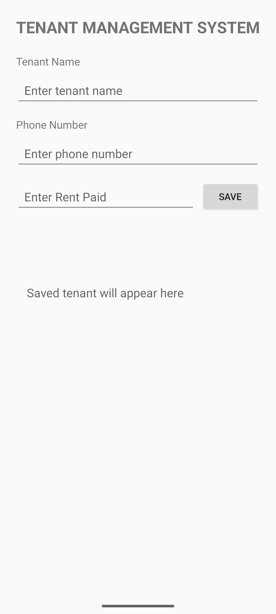
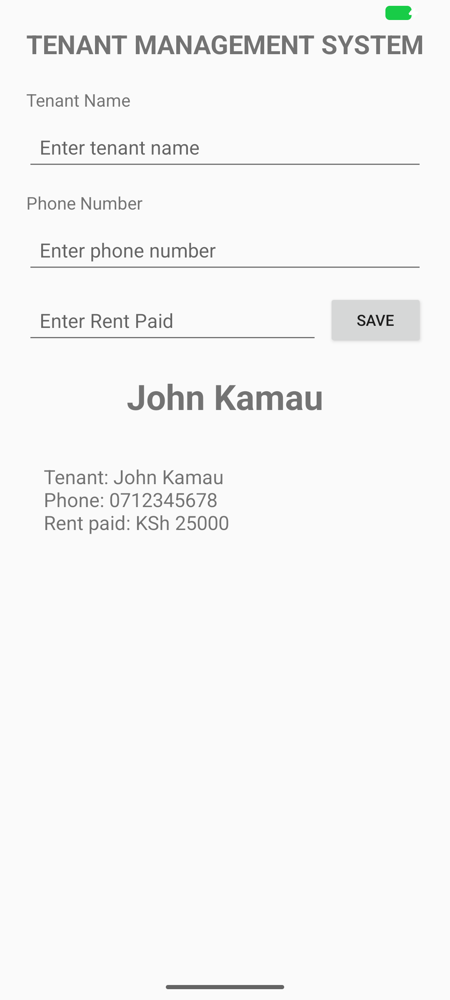

<h1 align="center">TenantManagementSystem</h1>
<p align="center">
  <em>An Add Tenant screen for a property manager, built with View Binding and Data Binding.</em>
  <br>
  <br>
  <a href="#overview">Overview</a> ·
  <a href="#screenshots">Screenshots</a> ·
  <a href="#what-it-does">What It Does</a> ·
  <a href="#how-to-run">How to Run</a> ·
  <a href="#project-structure">Project Structure</a> ·
  <a href="#built-with">Built With</a> ·
  <a href="#build-notes">Build Notes</a> ·
  <a href="#author">Author</a>
  <br>
  
  
  
  
</p>

---

TenantManagementSystem is the Android app built for the BBT 3.2 Mobile Application Development Lesson 6 practical at Strathmore University. It delivers a working Add Tenant screen: a form where a property manager enters a tenant's name, phone number and rent paid, and sees the saved tenant rendered back on the same screen.

The practical walks through the progression from a static screen, to View Binding, to Data Binding, so the app is as much a demonstration of those techniques as it is a usable form.

## Overview

The app has a single activity and a single screen. The layout is a ConstraintLayout that holds a title, three inputs (name, phone, rent), a SAVE button and a result area. Kotlin reaches the views through View Binding, and the result area reads a Tenant object directly through Data Binding.

The point of the exercise is the separation of concerns. MainActivity builds a Tenant and hands it to the layout, and the layout decides how that Tenant is displayed. Changing the display format means editing the Tenant class, not the activity.

## Screenshots

<p align="center">
  
  
</p>

On the left is the screen as it opens, with the result area showing its placeholder hint. On the right, a tenant has been saved: the name renders in large bold text and the summary is filled in by Data Binding. The three inputs clear on save.

## What it does

- Renders an Add Tenant screen laid out with ConstraintLayout.
- Reaches every view through View Binding, so a wrong id fails at compile time instead of crashing at runtime.
- Renders a Tenant object through Data Binding with `android:text="@{tenant.summary()}"`.
- Holds tenant data in a `Tenant` data class (`name`, `phone`, `rent`) with a `summary()` method.
- Validates input: an empty name shows a field error and blocks the save.
- Shows the saved tenant's name in large bold text above the summary.
- Clears the three input fields after a successful save.

## How to run

### Android Studio (recommended)

1. Open the project folder in Android Studio.
2. Let Gradle sync finish.
3. Start an emulator from Device Manager, or connect a device with USB debugging enabled.
4. Select the `app` run configuration and press Run.

### Command line

Build a debug APK:

```bash
./gradlew assembleDebug
```

Install and launch on a running emulator or connected device:

```bash
./gradlew installDebug
adb shell am start -n com.example.tenantmanagementsystemgroupa/.MainActivity
```

## Project structure

```
TenantManagementSystem/
├── app/
│   ├── build.gradle.kts
│   └── src/main/
│       ├── AndroidManifest.xml
│       ├── java/com/example/tenantmanagementsystemgroupa/
│       │   ├── MainActivity.kt
│       │   └── Tenant.kt
│       └── res/
│           ├── layout/
│           │   └── activity_main.xml
│           └── values/
│               ├── strings.xml
│               ├── themes.xml
│               └── colors.xml
├── gradle/
│   ├── libs.versions.toml
│   └── wrapper/
├── build.gradle.kts
├── settings.gradle.kts
├── gradle.properties
├── screenshots/
│   ├── add-tenant-empty.png
│   └── add-tenant-saved.png
└── README.md
```

## Built with

- Kotlin 2.2.10
- Android Gradle Plugin 9.1.1
- Gradle 9.3.1
- AndroidX AppCompat 1.7.0
- AndroidX ConstraintLayout 2.2.1
- AndroidX Core KTX 1.13.1
- minSdk 24, compileSdk 36, targetSdk 36

## Build notes

Android Studio 2026.1 ships Android Gradle Plugin 9, where Kotlin support is built in. Two consequences for anyone following the original practical guide:

- The Kotlin Android plugin is not applied. Applying it fails with `Cannot add extension with name 'kotlin'`.
- `kotlin-kapt` is not compatible with built-in Kotlin, and Data Binding no longer needs it. Turning on `dataBinding = true` is enough for the binding classes to be generated.

The project builds clean with `./gradlew assembleDebug`.

## Author

- Allan Ngugi - 191250

## License

UNLICENSED. Coursework submission for BBT 3.2 Mobile Application Development.
